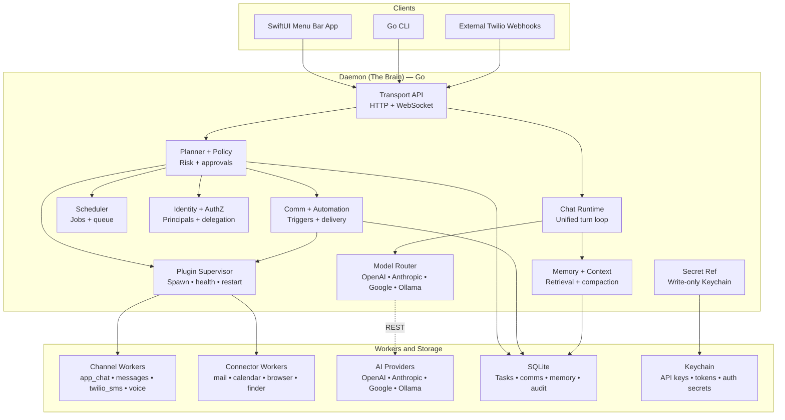
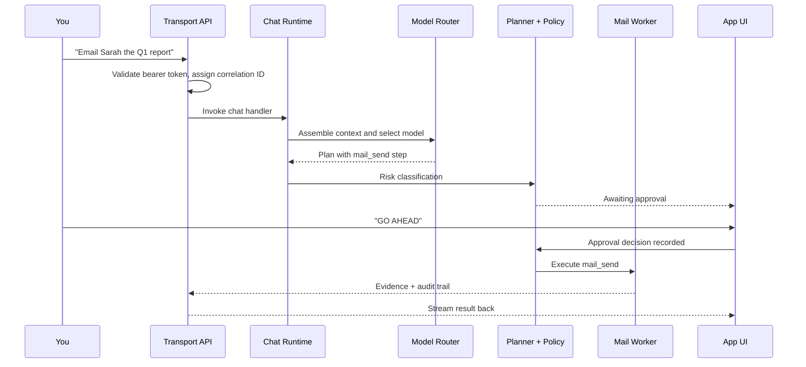
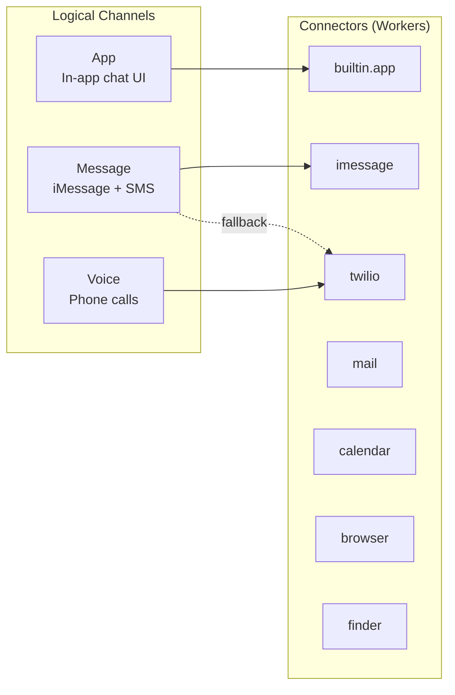
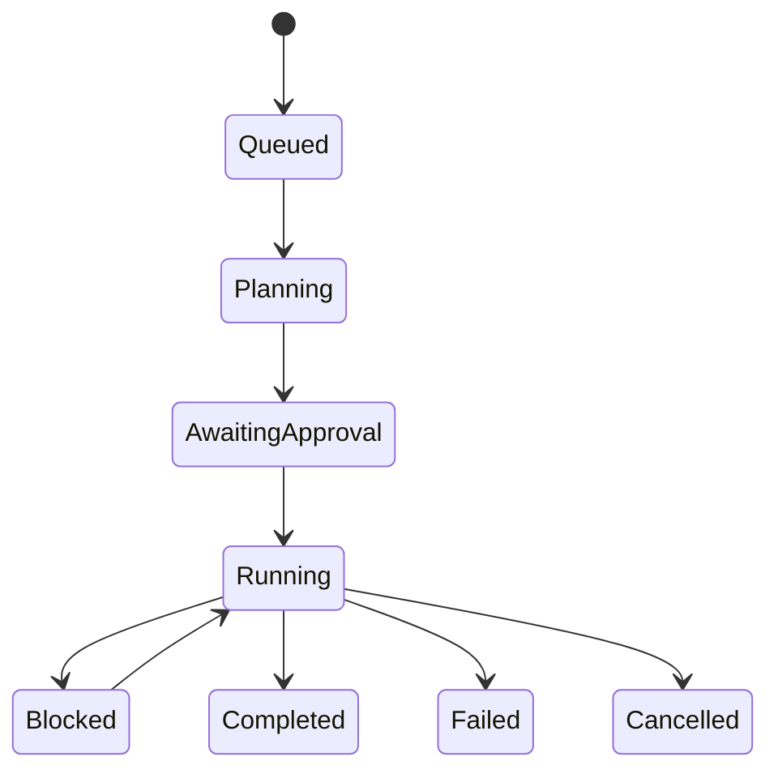

# PersonalAgent

<div align="center">
  <p><strong>Architecture Deep-Dive</strong></p>
  <p>A macOS-first autonomous assistant that operates like a human aide: chatting, messaging, calling, emailing, managing your calendar and files, all from one daemon brain.</p>
</div>

| Lines of Code | API Endpoints | CLI Commands | Tasks Shipped | Test Cases |
| --- | ---: | ---: | ---: | ---: |
| 151K | 109 | 129 | 543 | 1,584 |

## Status

PersonalAgent is active and pre-release. The codebase is substantial, but interfaces and workflows are still evolving. Treat `main` as the supported branch.

## Your Personal Operating System for Getting Things Done

Imagine a highly capable assistant that lives in your Mac's menu bar. You type or speak a request like "Email Sarah the Q1 report, then text John we're meeting at 3, and set a calendar reminder" and it just does it across your real apps, without needing 15 browser tabs and copy-paste.

PersonalAgent is the engine that makes that work. It plans tasks, routes them to the right apps like Mail, Calendar, Messages, Safari, and Finder, asks for your approval only when something is risky, and keeps a complete audit trail of everything it does.

| Capability | Description |
| --- | --- |
| Multi-Channel Communication | Talk to it via the app chat, iMessage/SMS, or voice calls. It responds on the same channel you used. |
| Autonomous Execution | Breaks requests into steps, runs them in parallel, retries on failure, and falls back to alternatives automatically. |
| Safety-First Approvals | Safe actions run instantly. Destructive ones like deleting files or sending important emails pause and ask you to confirm first. |
| Smart Model Routing | Routes each request to the best AI model across OpenAI, Anthropic, Google, or local Ollama based on task complexity, privacy needs, and cost. |

## The Full Anatomy



Dashed edges represent outbound external calls. The app, CLI, and inbound webhooks are thin clients; the daemon owns the system state and execution.

## Pick a Request, See What Lights Up

<details>
  <summary><strong>"Email Sarah the Q1 report"</strong></summary>

Components activated: Transport API, Chat Runtime, Model Router, Planner, Policy, Plugin Supervisor, Mail Worker, SQLite, Keychain.

Execution steps:
1. `mail_send` — Compose and send email to Sarah via Mail.app. Approval required.
</details>

<details>
  <summary><strong>"What's on my calendar today?"</strong></summary>

Components activated: Transport API, Chat Runtime, Model Router, Planner, Plugin Supervisor, Calendar Worker.

Execution steps:
1. `calendar_read` — Query today's events via EventKit. Auto-execute.
</details>

<details>
  <summary><strong>"Text John we're meeting at 3"</strong></summary>

Components activated: Transport API, Chat Runtime, Model Router, Planner, Policy, Plugin Supervisor, Messages Worker, Twilio Worker.

Execution steps:
1. `message_send` — Send iMessage via Messages.app as the primary path. Approval required.
2. `sms_fallback` — If iMessage fails, auto-fallback to Twilio SMS. Approval required.
</details>

<details>
  <summary><strong>"Find the budget PDF on my desktop"</strong></summary>

Components activated: Transport API, Chat Runtime, Model Router, Planner, Plugin Supervisor, Finder Worker.

Execution steps:
1. `finder_find` — Search Desktop for "budget" and PDF type. Auto-execute.
2. `finder_preview` — Return file path, size, and content preview. Auto-execute.
</details>

<details>
  <summary><strong>"Open arevelab.com in Safari and summarize it"</strong></summary>

Components activated: Transport API, Chat Runtime, Model Router, Planner, Plugin Supervisor, Browser Worker, Memory + Context.

Execution steps:
1. `browser_open` — Open the URL in Safari via Apple Events. Auto-execute.
2. `browser_extract` — Extract page title, URL, and content text. Auto-execute.
3. `model_summarize` — Route the extracted text to an AI model for summary. Auto-execute.
</details>

<details>
  <summary><strong>"Every morning at 8, summarize my emails and text me"</strong></summary>

Components activated: Transport API, Chat Runtime, Model Router, Planner, Policy, Plugin Supervisor, Mail Worker, Messages Worker, Twilio Worker, SQLite, Memory + Context, Scheduler.

Execution steps:
1. `directive_create` — Store the standing instruction as a Directive in SQLite. Auto-execute.
2. `trigger_schedule` — Create a schedule trigger that fires daily at 8:00 AM. Auto-execute.
3. `mail_read` — Fetch unread emails via Mail.app. Auto-execute.
4. `model_summarize` — Summarize the email content via the routed model. Auto-execute.
5. `message_send` — Send the summary via iMessage, with Twilio SMS fallback. Approval required.
</details>

## Watch a Request Flow Through the System



The same underlying flow powers the app, message, and voice channels.

## How It Talks to the Real World

PersonalAgent separates what it communicates through from how it communicates. That decoupling is the architectural superpower.



Message tries iMessage first. If it fails, the system can auto-fallback to Twilio SMS. New connectors can be added with no core behavior rewrite.

## Who Is Doing What, and On Whose Behalf?

Every action tracks three identity dimensions. Cross-principal execution requires explicit delegation.

| Requested By | Subject Principal | Acting As |
| --- | --- | --- |
| Who asked for the work? | Whose context is the work about? | Which identity actually executes the action? |
| "You told the assistant to do this." | "This concerns your partner's calendar." | "Send this email as your partner." |

## Task Lifecycle: From Idea to Done

Every request becomes a task with a well-defined state machine.



Tasks are broken into `TaskRuns`, and each run contains `TaskSteps`, the atomic units that actually do work. Each step carries typed input payloads, capability requirements, and timeout/retry policies.

> **Idempotency everywhere:** If a step is retried because of a network blip or worker restart, the system uses idempotency keys to prevent duplicate side effects. You should not get two emails sent because of a retry.

## The "Are You Sure?" System

Not all actions are equal. PersonalAgent classifies every step by risk and applies different rules.

| Risk Class | Meaning | Behavior |
| --- | --- | --- |
| Auto-Execute | Reversible, non-destructive actions like reading a calendar or checking a file | No approval needed |
| Require Confirm | Destructive or non-reversible actions like sending an email, deleting a file, or calling someone | You type `GO AHEAD` |
| Deny | Blocked by policy or ambiguous risk classification | Execution is blocked and asks to clarify |

> **Voice safety:** Destructive actions triggered via voice cannot be approved over voice. The system hands off to the in-app UI to avoid accidental approval during a call.

## It Doesn't Just React, It Anticipates

| Trigger Type | Example |
| --- | --- |
| `SCHEDULE` | "Every morning at 8am, summarize my unread emails and text me the top 3." |
| `ON_COMM_EVENT` | "When I get an iMessage from my boss with 'urgent', create a task immediately." |

Triggers are backed by durable Directives and fire with idempotency keys, so webhook retries do not create duplicate work.

## Why It's Built This Way

| Decision | Why |
| --- | --- |
| Daemon-First | All state and logic live in the daemon. The app and CLI are interchangeable thin clients. |
| Workers as Separate Processes | Each connector is its own supervised process. A Mail crash does not take down Calendar. |
| Native macOS Over Cloud APIs | It drives real macOS apps through Apple Events and EventKit using the accounts you already have. |
| Single SQLite | One DB and one serialized write path keep the system portable and zero-config. |
| Write-Only Secrets | API keys go in, but do not come back out. The daemon resolves references at execution time. |
| Append-Only Audit | Every action, approval, delivery, and state transition is recorded immutably. |

## What's Under the Hood

| Component | Technology | Why |
| --- | --- | --- |
| Daemon | Go 1.24 | Cross-platform, fast startup, and strong concurrency for worker supervision |
| CLI | Go 1.24 | Thin control-plane client over the same runtime contracts |
| macOS App | SwiftUI | Native menu bar app for chat, approvals, settings, and trace viewing |
| Control API | HTTP/JSON + WebSocket | OpenAPI 3.1, versioned `/v1/*`, localhost TCP |
| Persistence | SQLite | Single-writer queue boundary, zero-config, portable |
| Secrets | macOS Keychain | Write-only from clients; daemon resolves at execution time |
| macOS Integrations | Apple Events, EventKit | Native automation for Mail, Calendar, Messages, Safari, Finder |
| External Comms | Twilio | Webhooks inbound, REST outbound, cloudflared tunnel |

## Inside the Daemon: Package Map

Strict layering: `types -> config -> contract -> repository -> service -> runtime -> interface`. Cross-domain calls go through explicit interfaces only.

| Area | Responsibility |
| --- | --- |
| `transport/` | HTTP server, WebSocket broker, OpenAPI adapters, auth scoping, rate limiting, typed error envelopes |
| `chatruntime/` | Unified-turn orchestration with `model -> tool* -> model` loops and streaming deltas |
| `channels/` | Pluggable channel adapters like `app_chat`, `messages`, and `twilio` |
| `connectors/` | Mail, Calendar, Browser, Finder workers, each supervised as separate processes |
| `core/service/` | Agent execution, approval gates, authorization, triggers, delivery, retention, risk, scheduler |
| `persistence/` | SQLite storage, migrations, and the single-writer boundary |

## What Gets Stored

| Domain | Key Objects | What They Track |
| --- | --- | --- |
| Identity | `Workspace`, `Actor`, `WorkspacePrincipal`, `ActorHandle` | Who exists and who can act as whom |
| Execution | `Task`, `TaskRun`, `TaskStep`, `ApprovalRequest` | Work items, attempts, and atomic steps |
| Communication | `CommThread`, `CommEvent`, `CommCallSession` | Threads, messages, and voice sessions |
| Automation | `Directive`, `AutomationTrigger`, `TriggerFire` | Standing instructions, triggers, and executions |
| Integration | `ChannelConnectorBinding`, `RuntimePlugin`, `SecretRef` | Mappings, plugin health, and secret metadata |
| Memory | `MemoryItem`, `ContextDocument`, `ContextChunk` | Principal-scoped memory and retrieval indexes |
| Audit | `AuditLogEntry`, `TraceEvent`, `DeliveryAttempt` | Immutable records of actions and delivery |

> **Retention:** The explainer snapshot describes a 7-day default for traces, transcripts, and memory, with compaction to keep retrieval bounded.

## Where Everything Lives

| Directory | Contents |
| --- | --- |
| `source/services/daemon-go` | Go daemon runtime module |
| `source/clients/cli-go` | Go CLI module |
| `source/apps/macos/app-host` | Primary macOS app host |
| `source/apps/macos/app-host-v2` | v2 macOS app host and design track |
| `source/packages/contracts` | Shared transport and contract definitions |
| `docs/spec` | Product, bootstrap, and data-model specs |
| `tools/scripts` | Harness, packaging, launch, and test runner scripts |

## Current Delivery Snapshot

| Elapsed Window | Total Commits | Commits / Hour | Test-to-Source Ratio |
| --- | ---: | ---: | ---: |
| ~242h | 1,037 | ~4.3/hr | 47.3% |

## Quickstart

Run the repository checks:

```bash
tools/scripts/check_harness.sh
```

Run the full automated suite:

```bash
tools/scripts/run_tests_all.sh
```

Build the primary macOS app host:

```bash
cd source/apps/macos/app-host
xcodegen generate
xcodebuild \
  -project PersonalAgent.xcodeproj \
  -scheme PersonalAgent \
  -configuration Debug \
  -derivedDataPath ../../../../out/build/xcode-derived-data \
  CODE_SIGNING_ALLOWED=NO \
  build
```

## Core Docs

- Product spec: [`docs/spec/spec.md`](./docs/spec/spec.md)
- Data model: [`docs/spec/data-model.md`](./docs/spec/data-model.md)
- Bootstrap overview: [`docs/spec/bootstrap.md`](./docs/spec/bootstrap.md)
- Runtime architecture notes: [`docs/harness/ARCHITECTURE.md`](./docs/harness/ARCHITECTURE.md)
- Security baseline: [`docs/harness/SECURITY.md`](./docs/harness/SECURITY.md)
- Packaging guide: [`docs/ops/macos-daemon-packaging.md`](./docs/ops/macos-daemon-packaging.md)

## Contributing

Start with [CONTRIBUTING.md](./CONTRIBUTING.md). Use [SUPPORT.md](./SUPPORT.md) for general questions and [SECURITY.md](./SECURITY.md) for private vulnerability reporting.

## License

Licensed under the [Apache License 2.0](./LICENSE).
