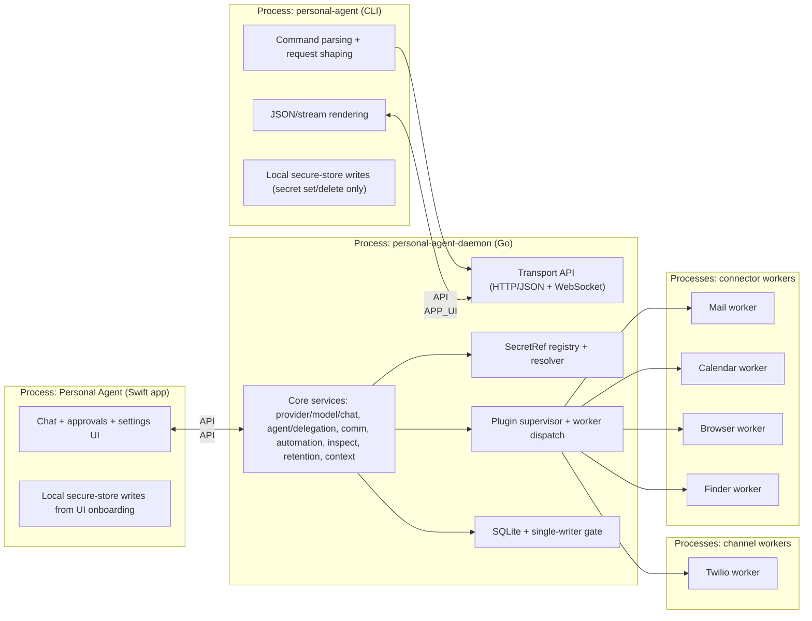
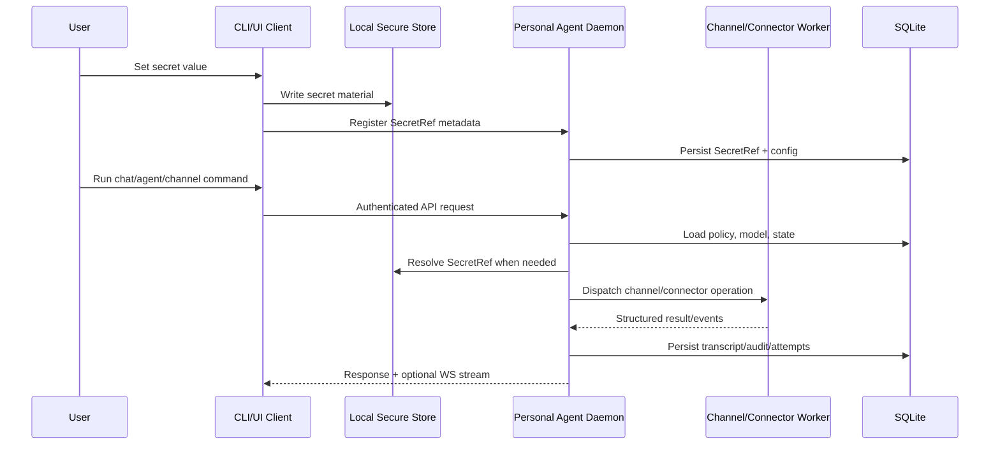

# Architecture

Top-level architecture map for the daemon-first MVP.

## Domains

1. `ui`: `Personal Agent` SwiftUI menu bar app for chat, approvals, settings, traces.
2. `daemon`: `Personal Agent Daemon` (Go) for task planning, policy, scheduling, orchestration, and plugin worker supervision.
3. `cli`: `Personal Agent CLI` (Go) thin client for daemon interaction and capability testing without UI.
4. `channels`: pluggable channel adapters executed as daemon-managed user-space worker processes.
5. `connectors`: pluggable connector adapters (Mail, Calendar, Browser, Finder in MVP) executed as daemon-managed user-space worker processes.
6. `persistence`: SQLite storage with serialized single-writer boundary (queue or equivalent gate), retention jobs.
7. `memory`: context retrieval, compaction, budgeted prompt assembly.
8. `transport`: platform-agnostic HTTP/JSON control APIs + WebSocket realtime streams, localhost TCP default, optional Unix socket/Windows named-pipe bindings.
9. `secrets`: write-only secret-value ingestion in client processes; daemon stores/resolves `SecretRef` metadata only and never exposes secret values in APIs.

## Running Processes

## Data Flow

## Layering Rule

Within each domain, depend only in this direction:

`types -> config -> contract -> repository -> service -> runtime -> interface`

Cross-domain dependencies must go through explicit interfaces/contracts.

## Lint Guardrails

- `tools/scripts/check_architecture_security_lint.sh` enforces package-layer import boundaries and fails when hotspot modules exceed configured line limits.
- `tools/scripts/check_architecture_security_lint.sh` also guards `source/services/daemon-go/internal/transport/types_payload_helpers.go` against direct `int(...)` coercion in risky `readAnyIntPointer` branches (`uint32`, `uint64`, `float32`, `float64`, `json.Number`), requiring checked conversion helpers instead.
- Current hotspot guards cover transport server/core backend paths, transport daemon-ops route modules, daemonruntime channel/connector worker-dispatch modules, daemonruntime comm inbox query modules, daemonruntime UI-status/identity modules, unified-turn orchestration modules, provider-model-chat modules, Twilio webhook runtime modules, Twilio voice persistence adapter modules, agent intent parsing modules, high-traffic OpenAPI adapter modules, queued-task/control-backend runtime modules, plugin supervisor modules, CLI main entrypoint, CLI quickstart/doctor modules, split CLI root-registry domain files, and split CLI command-discovery modules.

## Extension Rule

- Channels and connectors are selected through a registry keyed by declared capabilities.
- New adapters must implement shared contracts and register without planner/policy internal edits.
- Daemon-supervised plugin workers must register capabilities via startup handshake before routing.
- Adapter failures must return structured errors preserving retry/idempotency semantics.

## Invariant Focus

- Boundary inputs are validated.
- Writes are idempotent where retries are possible.
- Audit and trace events are append-only.
- Policy checks happen before side effects.
- Daemon startup/shutdown executes in deterministic phases with rollback on startup failure and ordered runtime drain during shutdown.

## Canonical Companion Docs

- `docs/spec/spec.md`
  - Canonical runtime behavior and product policy.
- `docs/spec/data-model.md`
  - Canonical schema and persistence invariants.
